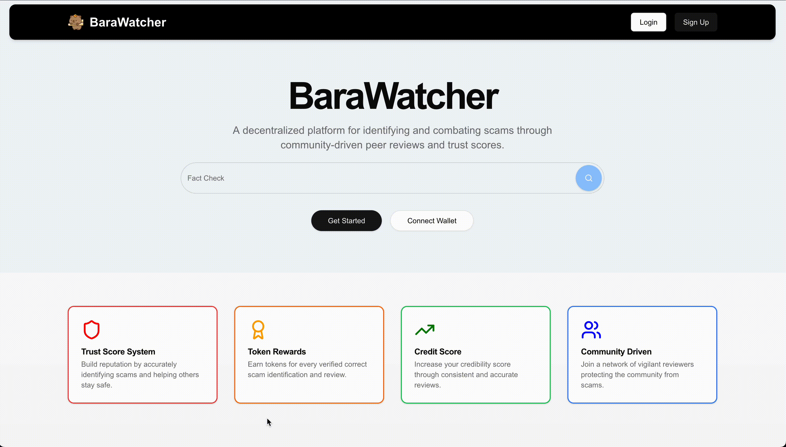
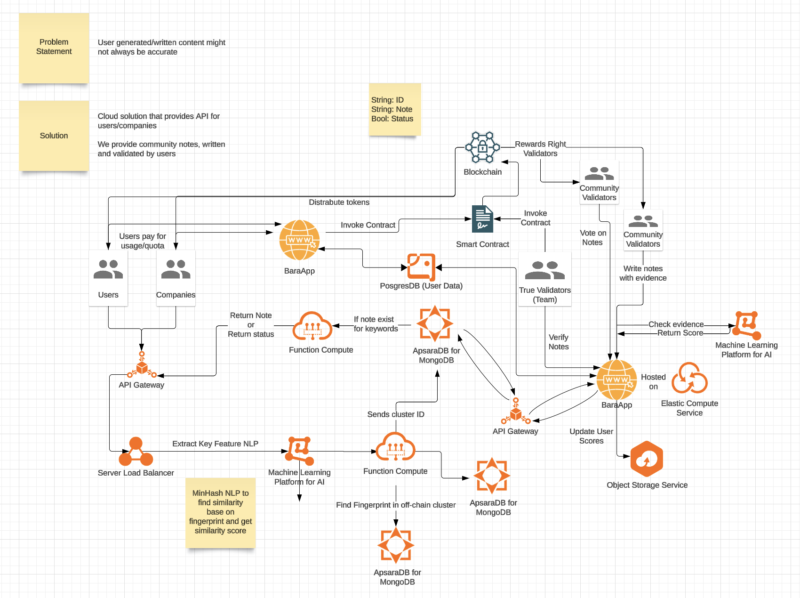

# Hackathon Project for SIT Hackrift 2024

## Problem Statement
User-generated content often lacks verification, leading to the spread of misinformation
- Content can appear credible but is factually incorrect.
- Misinformation spreads quickly due to lack of oversight or validation.
- Audiences may struggle to discern accurate from inaccurate information.

## Solution (BaraWatcher)
BaraWatcher is a decentralized platform that leverages community validators and trusted validators to collaboratively combat misinformation while ensuring transparency and fairness through smart contracts. Its cloud-based, scalable system incentivizes contributors with tokenized rewards and provides reliable, verified content via API integration.

## Technology Stack
- Next.JS App Router for the frontend and serverless function
- Postgresql hosted by Supabase
- Prisma ORM to connect to the database
- Better-Auth as the authentication library

## Presentation slides
You may download and view our ppt slides [here](resources/BabyBara.pptx)

## Landing page


## Architecture Overview


## Getting Started
1. Copy/rename `.env.sample` to `.env`
2. Get the DATABASE_URL and DIRECT_URL from Supabase. You may follow the tutorial over [here](https://supabase.com/partners/integrations/prisma)
3. Create a random key for Better-Auth
4. `npm install` to install necessary libraries
5. `npx prisma migrate dev` to generate necessary types and instantiate database if needed.
6. Run the follow code below to start the development server
```bash
npm run dev
# or
yarn dev
# or
pnpm dev
# or
bun dev
```
Open [http://localhost:3000](http://localhost:3000) with your browser to see the result.

## Contributors
Ryan Chua: [@Ryanchuaks1](https://www.github.com/Ryanchuaks1)
Ariel Yong: [@arielyongg](https://www.github.com/arielyongg)
Adrian Pang: [@skyish242](https://github.com/skyish242)
Teo Zhi Kai: [kaiii299](https://www.github.com/kaiii299)
Xavier Ong: [@xavieroyj](https://github.com/xavieroyj)


### Note
Special thanks to SITech Developers Club for hosting the event